## Flexures

In the study of flexures we think of a bar or bars as being flexible,
but not stretchable or compressible longitudinally. Many uses can be made of
this flexibility. We will start with two-dimensional figures and the flexures
themselves flat springs for simplicity. Then we will proceed to the three
dimensional cases using flexible rods or even wires.

### 2 DOF:

The simplest structure is a single flat spring joining two bodies as
in Fig. 1. It might be a pendulum. This simple case has some defects such as
not having a definite pivot point. It is also possible for the suspended body
to move sideways. Only one dimension is reasonably fixed and that is the
distance between the bodies.

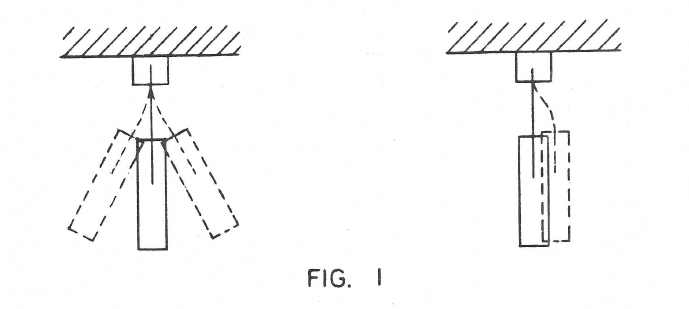

On the other hand even this simplest structure illustrates a very
important property of flexures -- namely the complete absence of static friction.
In other words it obeys Hook's law which states that for small motions the
displacement is propotional to the applied force. This is not strictly true for
even the best ball bearing for some finite force is necessary to overcome static
friction before motion results.

Two flat springs can be used in several ways. Figure 2 shows a common
form. It is known as the Kardon hinge and is used, as you may know, in some
Grandfather's clocks to suspend the pendulum. Two degrees of freedom are now
controlled so we have achieved a fixed pivot point where the springs cross. This
if of course for small motions.

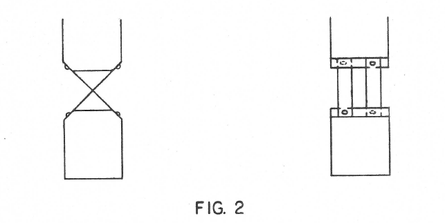

Another similar case would be as in Figure 3 where the two springs do not
cross each other. The pivot point now becomes a virtual one inside the pendulun
and it will rotate about this point. Figure 4 illustrates another variation where
the virtual pivot is not inside the Pendulum bar but up in the support. This case
should make possible the building of a shorter Grandfather's clock. (Warning: This
is a tricky procedure. Do not push it too far).

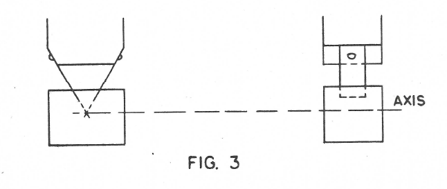
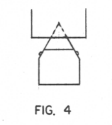

Figure 5 shows a very important arrangement of two flexures where they
are parallel. The horizontal bar is fixed in the vertical direction and in one
degree of rotation but is free to move sideways.

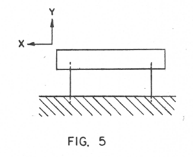

Two flexures can therefore be used to control either the two position
coordinates or one position coordinate and one rotation coordinate.

Finally Figures 6 and 7 show how all three coordinates two in position and
one in angle may be controlled by three flexures springs.

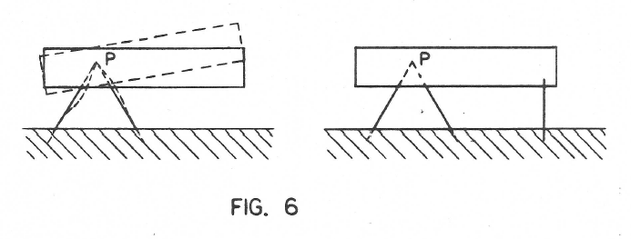
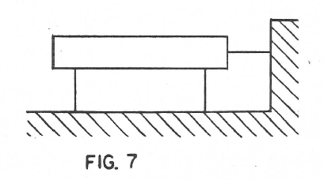

This I helieve completes the two dimensional case. The three dimensional
case is much more extensive and interesting because we have not 3 degrees of freedom
to manipulate but 6.

### 3 DOF:

#### One Flexure

The simplest case in 3 dimensions is the single bar as in Fig. 8. It
merely holds the body at a given distance vertically. All three angular motions
are permitted and also two displacements.

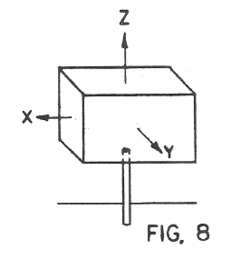

It would not seem to be very useful but it really is used a lot in the
mounting of instruments. If the flexure is a heavy post the 5 permitted degrees
of freedom are really not so free. It does hold the instrument in the vertical
direction and if the length of the post is adjustable, such as by having the
instrument slide up and down and then be clamped this one dimension can be precisely
controlled.

#### Two Flexures

Figures 9A and 9B show two arrangements of two flexures. In 9A the
flexures are parallel and so one angle is controlled in addition to the vertical
direction. In Figure 9B we have two positional coordinates of the point P control-
led but no angular coordinates controlled.

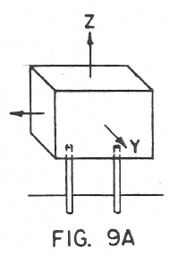
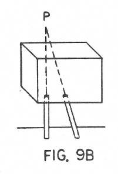

In addition there would be the case where the two flexures are skew
to each other. The skew type appears not to be so useful and no cases of it will
be discussed in this report.

#### Three Flexures

Figures 10A, 10B, and 10C show three simple types. Figure 10A would
correspond to a sliding plate. Figure 10B is a very interesting one because it
controls all three positional coordinates of the virtual point P in the body but
no angular coordinates are controlled. It is the common tripod. It also corresponds
to the ball and socket joint.

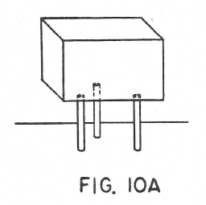
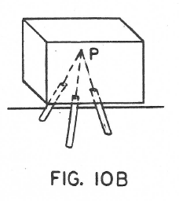
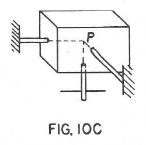

For some purposes it is advisable to have each flexure parallel to one
of the three coordinate axis. In Fig. 10A this is already the case, all three are
parallel to the Z axis. Fig. 10B however could be made like Fig. 10C.

The importance of this is that if the three are independently adjustable in length we
have independent control of motion parallel to each of the three axes. For example if
the flexure parallel to the X axis is extended the point P in the body will move
in the X direction without significant components of motion in the Y or Z
directions. (Remember of course that this is for small motion).

Instead of systematically going through cases for 4, 5 and 6 flexures the
accompanying table is presented. It is hoped that this will possibly simplify the
subject and maybe stimulate readers to fill in vacant places with their own inven-
tions. In many cases there are more than one solution.

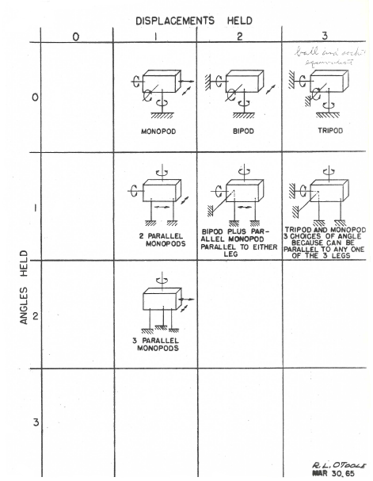

The lower right rectangle with all six degrees of freedom held is
particularly interesting because one of the solutions is the common six legged
tripod such as used on transits or on heavy cameras.

by Dr. John H. McLeod

JHMcLeod/me

March 30, 1965

